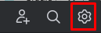
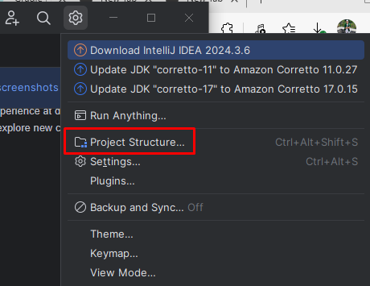
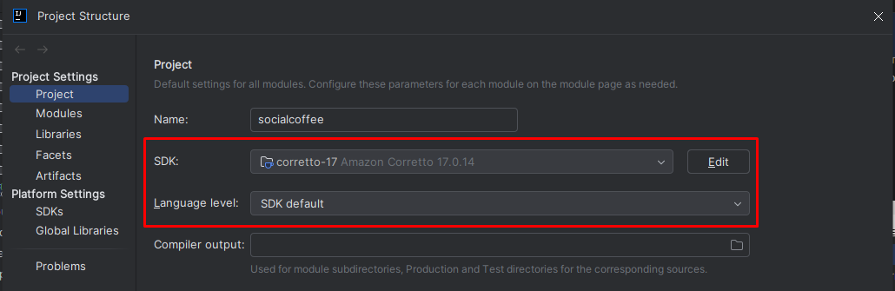

# ☕ SocialCoffee
### An application for discovering, reviewing, and sharing café spaces

---

## 📄 Description

**SocialCoffee** is a social platform built for coffee lovers. It allows users to explore, review, and share their experiences at various coffee shops. The application serves as a centralized hub for discovering cafés, reading authentic user reviews, and receiving personalized recommendations.

---

## 🛠️ Project Setup

### 🔧 Recommended IDE: IntelliJ IDEA

IntelliJ is highly recommended as it supports Java and Spring Boot out-of-the-box.

#### Setup SDK and Language Level

1. Click the **Settings** button in the top tab bar  
   
2. Navigate to **Project Structure**  
   
3. Set the **Project SDK** to **Java 21**  
   

---

### 📦 Build Tool: Gradle

This project uses **Gradle**. Ensure Gradle is installed and the environment variable is set.

- More info: [Gradle Installation Guide](https://gradle.org/install/)

---

### ☕ Java

- Required version: **Java 21**

---

## 🗄️ Database Setup

### 🐘 PostgreSQL

- Version: Any recent stable version (e.g., 14+)
- Create a database named: `socialcoffee`

#### Initialization Steps:

1. Run `resources/sql/database.sql` to create the schema.
2. Run `resources/sql/review.sql` to populate initial reviews.

#### Creating an Account

- **Option 1 (Recommended):** Register via the application UI (backend + frontend running).
- **Option 2:** Insert directly into PostgreSQL *(not recommended as passwords must be encrypted)*.

---

### 🧠 Neo4j

- Neo4j is used for the recommendation algorithm.

#### Notes:

- Optional for general usage.
- Required **only** when using the recommendation system.
- Ensure Neo4j is running when executing the application with recommendations enabled.

---

### 🌐 GroqCloud API

- Register at: [GroqCloud Console](https://console.groq.com/keys)
- Obtain the API key and place it in either:

    - `.env` file  
      **or**
    - `resources/application.properties`

---

### 🧪 Environment Configuration

You can define environment variables using either:

- `.env` file  
  *or*
- Directly in `resources/application.properties`

---

## 🚀 Final Step

After all configurations are complete:

- Run the application using IntelliJ’s **Run** feature  
  *or*
- Use Gradle to build and run the JAR:

```bash
./gradlew build
java -jar build/libs/socialcoffee.jar
